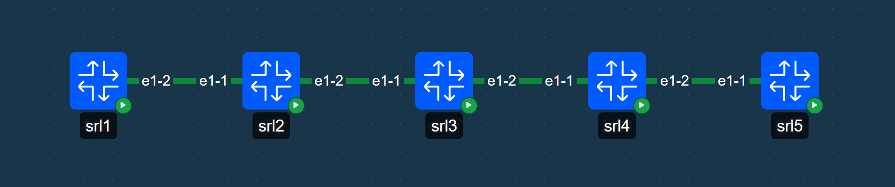

# SRLX — SR Linux Multi-Node Command Executor With Topology Discovery

[](LICENSE)

`srlx` is an SR Linux CLI extension and background daemon that automatically discovers fabric switches via **LLDP + mTLS gossip** and allows you to execute commands across one, several, or all nodes directly from your local terminal.



---

## ⚡ Quickstart

1. **Build the package:**
   ```bash
   ./build-deb.sh
   ```

2. **Generate CA Cert for lab:**
   ```bash
   containerlab tools cert ca create -p lab/tls
   ```

3. **Deploy lab & install srlx on switches:**
   ```bash
   # Deploy test lab with Containerlab (includes mTLS CA)
   containerlab deploy -t lab/srlx-test.clab.yaml

   # Install SRLX package on all nodes
   for node in srl1 srl2 srl3 srl4 srl5; do
     docker cp srlx_0.0.6.deb $node:/tmp/
     docker exec $node dpkg -i /tmp/srlx_0.0.6.deb
   done
   ```

4. **Run multi-node commands on lab devices:**
   ```text
   A:root@srl1# srlx show version
   A:root@srl1# srlx srl3 srl5 info interface ethernet-1/1
   ```

---

## 📖 Command Reference

| Command | Description |
| :--- | :--- |
| `srlx [nodes...] <command>` | Execute a command across target node(s) (or all nodes if omitted) |
| `show srlx devices` | Display discovered topology table, reachability, and reporters |
| `show srlx device <node> [detail]` | Show detailed attribution and security telemetry for a node |
| `tools srlx clear [all \| device <node>]` | Flush local topology cache and force immediate re-discovery |

*Supports native SR Linux output format modifiers: `| as json`, `| as yaml`, `| as table`.*

---

## 🔒 Security & mTLS

- **2-Way Mutual TLS**: Validates node certificates against the root CA (`ca.pem`) before sending authentication headers or executing commands.
- **Auto-Discovery of Certs**: Automatically uses `/etc/opt/srlinux/tls/ca.pem` and the active switch profile (`clab-profile` / `__default__`).
- **Credentials Precedence**: `~/.netrc` (mode `0600`) $\to$ `$SRLX_USER` / `$SRLX_PASS` $\to$ `~/.srlx.json` $\to$ default (`admin:NokiaSrl1!`).

---

## 📄 License

[MIT](LICENSE)
